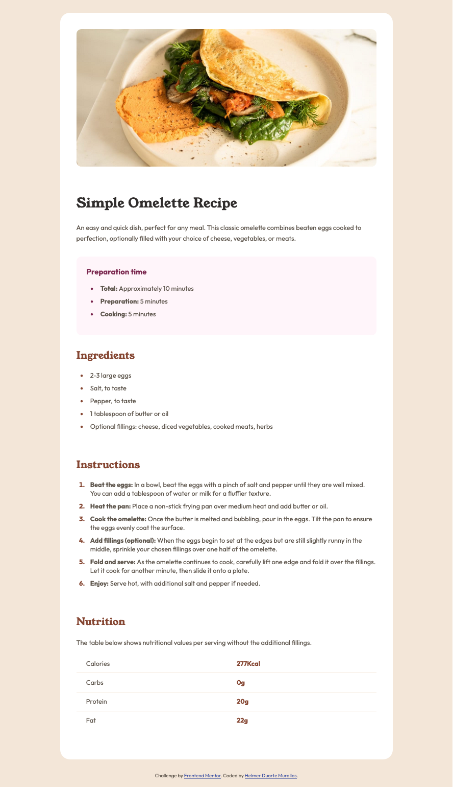

# Frontend Mentor - Recipe page solution

This is a solution to the [Recipe page challenge on Frontend Mentor](https://www.frontendmentor.io/challenges/recipe-page-KiTsR8QQKm). Frontend Mentor challenges help you improve your coding skills by building realistic projects. 

## Table of contents

- [Overview](#overview)
  - [The challenge](#the-challenge)
  - [Screenshot](#screenshot)
  - [Links](#links)
- [My process](#my-process)
  - [Built with](#built-with)
  - [What I learned](#what-i-learned)
  - [Continued development](#continued-development)
  - [Useful resources](#useful-resources)
  - [AI Collaboration](#ai-collaboration)
- [Author](#author)
- [Acknowledgments](#acknowledgments)

**Note: Delete this note and update the table of contents based on what sections you keep.**

## Overview

### Screenshot

### Links

- Solution URL: [Add solution URL here](https://your-solution-url.com)
- Live Site URL: [Add live site URL here](https://your-live-site-url.com)

## My process

### Built with

- Semantic HTML5 markup
- CSS custom properties (variables)
- Flexbox
- Mobile-first workflow

### What I learned

During this project, I focused on building a clean and semantic HTML structure before styling. This helped me better understand how layout and content should be organized.

Some key learnings:

- How to structure a page using <main> and <section>
- The importance of proper heading hierarchy (h1 → h2)
- Styling lists using ::marker
- Controlling spacing using margin, padding, and line-height
- Improving table layout with border-collapse and better use of <td> and <th>

Example of HTML structure I’m proud of:

<section class="instructions">
  <h2>Instructions</h2>
  <ol>
    <li><strong>Beat the eggs:</strong> In a bowl, beat the eggs...</li>
    <li><strong>Heat the pan:</strong> Place a non-stick frying pan...</li>
  </ol>
</section>

Example of CSS I found useful:

ol li::marker {
  color: var(--Brown-800);
  font-weight: 700;
}

table {
  border-collapse: collapse;
  width: 100%;
}

### Continued development

In future projects, I would like to Improve my CSS layout skills, especially spacing and alignment.
Get more comfortable with responsive design techniques. Practice writing more accessible HTML, and
start integrating JavaScript into my projects.

### AI Collaboration

During this project, I mainly used ChatGPT when I got stuck or needed help understanding specific things, especially related to CSS table and <li> styling. At the beginning, I also tried GitHub Copilot, but I decided to disable it because it was generating most of the code for me. Although it was impressive, I preferred to write everything myself to really practice and understand the process. Overall, I used AI as a support tool rather than a solution generator, which helped me stay involved and improve my skills while building the project from scratch.

## Author

- Frontend Mentor - [@helmer12](https://www.frontendmentor.io/profile/helmer12)
- Twitter - [@HelmerDuarte](https://x.com/HelmerDuarte)

## Acknowledgments

Thanks to the Frontend Mentor community for providing this challenge and helping me improve my frontend development skills. I am so happy!